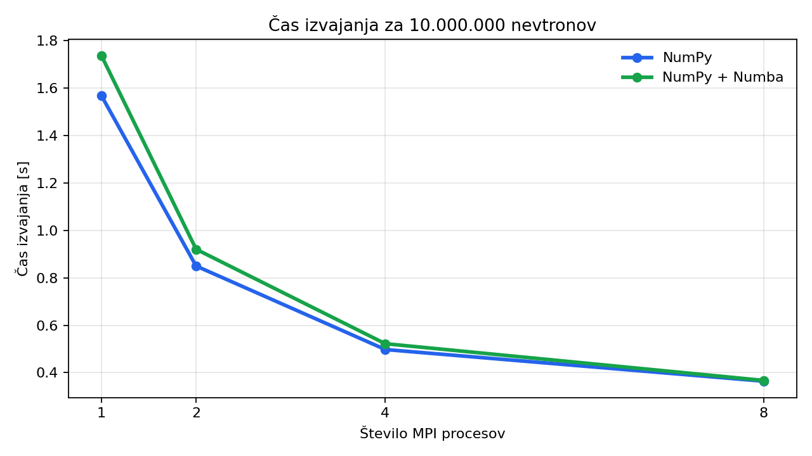
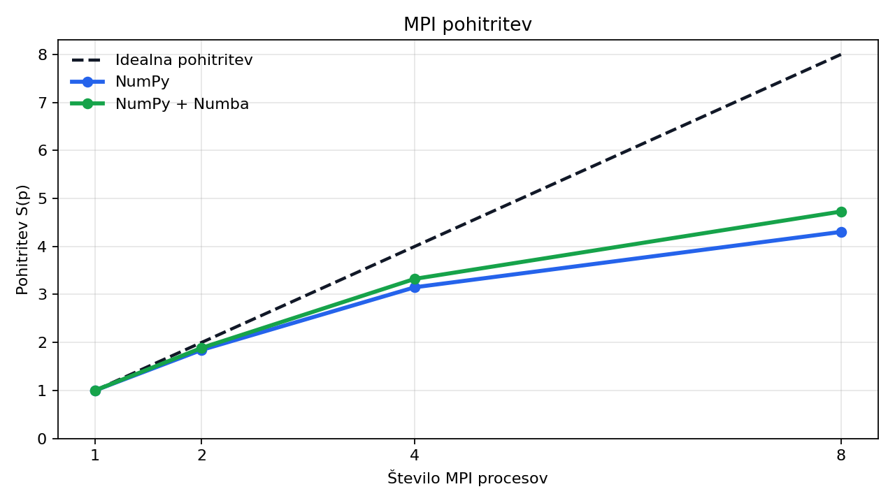
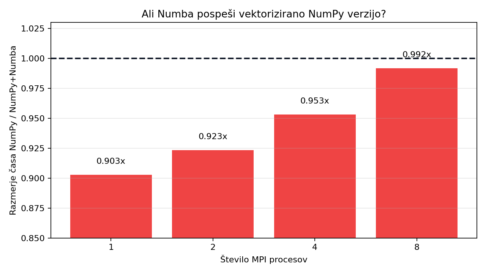

# Simulacija transporta nevtronov

Projekt vsebuje poenostavljeno Monte Carlo simulacijo transporta nevtronov skozi materialno plast. Simulacija uporablja Python, `mpi4py`, NumPy in dodatno verzijo z Numbo, da se lahko primerja vpliv različnih načinov optimizacije.

## Opis modela

Vsak nevtron začne v točki `(x, y) = (0, 0)`. Debelina materiala je določena v smeri `x`, smer `y` pa predstavlja stranski odmik nevtrona.

Pri vsakem koraku se naključno določi dolžina proste poti. Nevtron se premakne v trenutni smeri, nato se preveri:

- če je `x < 0`, je nevtron odbit,
- če je `x >= debelina`, je nevtron prepuščen,
- sicer se lahko absorbira,
- če se ne absorbira, se po sipanju izbere nov naključen kot gibanja v 2D.

Program meri tudi povprečen `|y|`, kar pokaže stranski odmik nevtronov pri koncu simulacije.

## Datoteke

- `main.py` - trenutna NumPy + MPI verzija
- `main_numba.py` - trenutna NumPy + Numba + MPI verzija
- `RESULTS.md` - surovi rezultati zagonov
- `simulacija-transporta-nevtronov-numpy-numba-primerjava.pptx` - predstavitev zadnje primerjave
- `readme_assets/` - diagrami za README

## Namestitev

Na macOS je najprej potreben Open MPI:

```bash
brew install open-mpi
```

Python paketi:

```bash
pip install mpi4py numpy numba matplotlib
```

## Zagon

NumPy verzija:

```bash
mpirun -np 4 python3 main.py --neutrons 10000000
```

NumPy + Numba verzija:

```bash
mpirun -np 4 python3 main_numba.py --neutrons 10000000
```

Število procesov se določi z `-np`, število nevtronov pa z argumentom `--neutrons`.

## Izračun metrik

Pohitritev:

```text
S(p) = T(1) / T(p)
```

Karp-Flatt metrika:

```text
e = ((1 / S(p)) - (1 / p)) / (1 - (1 / p))
```

## Poročilo 1: Python zanke proti Numbi

V prvem koraku je bila primerjana osnovna izvedba, kjer se je večina simulacije izvajala v običajnih Python zankah, proti verziji z Numbo. Meritve so bile izvedene z `10000000` nevtroni.

| Procesi | Čas brez Numbe [s] | Čas Numba [s] | S brez Numbe | e brez Numbe | S Numba | e Numba |
|--------:|-------------------:|--------------:|-------------:|-------------:|--------:|--------:|
| 1       | 17.766             | 0.923         | 1.00         | 0.000        | 1.00    | 0.000   |
| 2       | 9.049              | 0.477         | 1.96         | 0.019        | 1.94    | 0.033   |
| 4       | 5.723              | 0.296         | 3.10         | 0.096        | 3.12    | 0.094   |
| 8       | 3.758              | 0.188         | 4.73         | 0.099        | 4.91    | 0.090   |

### Interpretacija prvega koraka

Numba je v tem primeru bistveno zmanjšala absolutni čas izvajanja, ker je pospešila notranjo Monte Carlo zanko. Pri enem procesu se je čas zmanjšal iz približno `17.766 s` na `0.923 s`.

MPI pohitritev je ostala podobna pri obeh izvedbah. To je pričakovano, ker Numba pospeši računanje znotraj posameznega procesa, ne odstrani pa režije zagona procesov, sinhronizacije in operacije `MPI_Reduce`.

## Poročilo 2: NumPy proti NumPy + Numba

Po pripombi, da bi bilo bolje uporabiti vektorske operacije v NumPy-ju, je bila osnovna verzija popravljena. Namesto simulacije nevtronov enega po enega v Python zanki se sedaj v `main.py` uporablja NumPy polja in maskiranje aktivnih nevtronov.

Druga verzija, `main_numba.py`, uporablja enako batch logiko s polji `x`, `y`, `angle`, `steps` in `active`, dodatno pa je funkcija prevedena z Numbo.

Meritve so bile izvedene z `10000000` nevtroni.

| Procesi | Čas NumPy [s] | Čas NumPy + Numba [s] | NumPy / Numba | S NumPy | S Numba | e NumPy | e Numba |
|--------:|--------------:|----------------------:|--------------:|--------:|--------:|--------:|--------:|
| 1       | 1.567         | 1.736                 | 0.903x        | 1.00    | 1.00    | 0.000   | 0.000   |
| 2       | 0.850         | 0.920                 | 0.923x        | 1.84    | 1.89    | 0.084   | 0.060   |
| 4       | 0.498         | 0.522                 | 0.953x        | 3.15    | 3.32    | 0.090   | 0.068   |
| 8       | 0.364         | 0.367                 | 0.992x        | 4.30    | 4.73    | 0.123   | 0.099   |

Vrednost `NumPy / Numba` pod `1` pomeni, da je bila čista NumPy verzija hitrejša od verzije z Numbo.

### Diagrami







### Interpretacija drugega koraka

Po vektorizaciji se glavno delo že izvaja v optimiziranih NumPy operacijah. Zato Numba ni prinesla dodatnega pospeška. V vseh meritvah je bila čista NumPy verzija rahlo hitrejša ali skoraj enaka kot NumPy + Numba.

Največja razlika je pri enem procesu, kjer je NumPy izvedba trajala `1.567 s`, NumPy + Numba pa `1.736 s`. Pri osmih procesih sta izvedbi skoraj izenačeni: `0.364 s` proti `0.367 s`.

Rezultat kaže, da je Numba zelo uporabna pri običajnih Python zankah, vendar pri že dobro vektorizirani NumPy kodi ne zagotavlja nujno dodatnega pospeška. V tem primeru je najboljša izbira čista NumPy + MPI izvedba.
